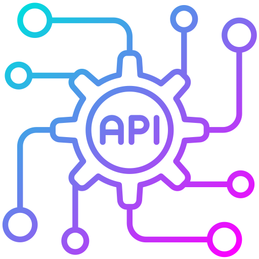

[![LinkedIn][linkedin-shield]][linkedin-url]
[![Github][github-shield]][github-url]
[![Gmail][gmail-shield]][gmail-url]
[![Twitter][twitter-shield]][twitter-url]

 

    

<h3 align="center">Python API Project Ideas</h3>

A collection of useful APIs available for free

<!-- TABLE OF CONTENTS -->

    
Table of Contents

    <ul><li><a href="#important-note">Important Note</a></li></ul>
    <ol>
        <li>
            <a href="#wordsapi">WordsAPI</a>
            <ul><li>Find definitions, related words, and more</li></ul>
        </li>
        <li>
            <a href="#i❤pdf-api">I❤PDF API</a>
            <ul><li>Multiple tools for working with PDFs</li></ul>
        </li>
        <li>
            <a href="#market-data-api">Alpaca Market Data API</a>
            <ul><li>Access Historical/realtime Stock, EFT, and Crypto information</li></ul>
        </li>        
    </ol>

 

<!-- Using Markdown instead of HTML formatting from here for readability -->

## Important Note

**If you want to store your project on a public github repo, keep your API key in a file included in `.gitignore` or use the [dotenv][dotenv-link] package ([Helpful Youtube tutorial](https://youtu.be/CJjSOzb0IYs))**

---

## WordsAPI

The [Words API][words-api-link] database has over 150,000 words, and can return:
- definitions
- synonyms
- part of speech
- example sentences
- Rhymes
- pronunciation
- word frequency
- and more... (see [Docs](https://www.wordsapi.com/docs/?python#words))

Can also return hierarchical information, such as:  
- a *hatchback* is a **type of** *car*
- a *finger* is a **part of** a *hand*
- *oxygen* is a **substance of** *water*

You can test it out [Here](https://www.wordsapi.com/#try)  
To incorporate in project, you'll need a free account. But you will get billed for each request after your 2500 request daily limit. Read [Important Note Section](#important-note)  

**Request Limit**: 2500/per day  
**Standard**: [REST][rest-link]  
**Output**: [JSON][json-link]

(<a href="#readme-top">back to top</a>)

---

## I❤PDF API

[I❤PDF][I❤PDF-link] and the [API][I❤PDF-api-link] is a resource for doing LOTS of things with PDF files including:

- Converting from/to Word, Powerpoint, Excel, JPG 
- Merging, Splitting, Organising
- Compressing
- Repairing
- Unlocking (Removing Password)

For more details see the [API Reference Docs](https://developer.ilovepdf.com/docs/api-reference)  
Again, there is a limit to your free account, so read [Important Note Section](#important-note)

**Request Limit**: 250/per month  
**Standard**: [REST][rest-link]  
**Output**: [JSON][json-link]

(<a href="#readme-top">back to top</a>)

---

## Market Data API

Access Alpaca’s historical (5 years) and real-time US [stock market API][alpaca-market-api-link] and [crypto data API][alpaca-crypto-api-link].  
There is also support for ETFs listed in the US public exchanges (NMS stocks)  

Alpaca also provides a PyPI package [alpaca-py][alpaca-py-link]  
Also has the WebSocket protocol available for real time updates without pulling the server.  
For more information see the [API Reference Docs](https://alpaca.markets/docs/api-references/)

**Request Limit**: 200/calls min  
**Standard**: [REST][rest-link] & [WebSocket][websocket-link]  
<!-- **Output**: [JSON][json-link] -->

(<a href="#readme-top">back to top</a>)

<!-- MARKDOWN LINKS & IMAGES -->
<!-- https://www.markdownguide.org/basic-syntax/#reference-style-links -->

<!-- Badges: https://dev.to/envoy_/150-badges-for-github-pnk -->
[linkedin-shield]: https://img.shields.io/badge/LinkedIn-0077B5?style=for-the-badge&logo=linkedin&logoColor=white
[linkedin-url]: https://linkedin.com/in/sciwilro
[github-shield]: https://img.shields.io/badge/GitHub-100000?style=for-the-badge&logo=github&logoColor=white
[github-url]: https://github.com/SciWilro
[gmail-shield]: https://img.shields.io/badge/Gmail-D14836?style=for-the-badge&logo=gmail&logoColor=white
[gmail-url]: mailto:mr.wilro@gmail.com
[twitter-shield]: https://img.shields.io/badge/Twitter-1DA1F2?style=for-the-badge&logo=twitter&logoColor=white
[twitter-url]: https://twitter.com/The_Wilro

[words-api-link]: https://www.wordsapi.com/
[I❤PDF-link]: https://www.ilovepdf.com/
[I❤PDF-api-link]: https://developer.ilovepdf.com/
[alpaca-market-api-link]: https://alpaca.markets/docs/market-data/
[alpaca-crypto-api-link]: https://alpaca.markets/docs/crypto/

[alpaca-py-link]: https://pypi.org/project/alpaca-py/
[dotenv-link]: https://pypi.org/project/python-dotenv/

[rest-link]: https://restfulapi.net/
[websocket-link]: https://en.wikipedia.org/wiki/WebSocket
[json-link]: http://www.json.org/

<!-- Sources for making README -->
<!-- see https://github.com/othneildrew/Best-README-Template-->